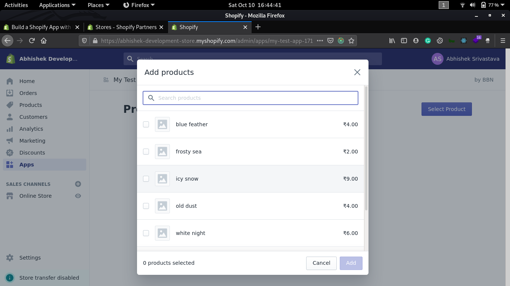

# Shopify App Node

## Use cases

* If prompts for user login through command line/terminal.
* Once logged in, you'll be inside your Shopify store.
* You can create populate sample items for testing.

## Images 

</img>

## Requirements

- If you don’t have one, [create a Shopify partner account](https://partners.shopify.com/signup).
- If you don’t have one, [create a Development store](https://help.shopify.com/en/partners/dashboard/development-stores#create-a-development-store) where you can install and test your app.
- In the Partner dashboard, [create a new app](https://help.shopify.com/en/api/tools/partner-dashboard/your-apps#create-a-new-app). You’ll need this app’s API credentials during the setup process.

## Usage

This repository uses [Shopify-App-CLI](https://github.com/Shopify/shopify-app-cli) as a scaffold for Node apps. It’s faster and easier to use Shopify App CLI, which handles additional routine development tasks for you.

## License

This respository is available as open source under the terms of the [MIT License](https://opensource.org/licenses/MIT).
